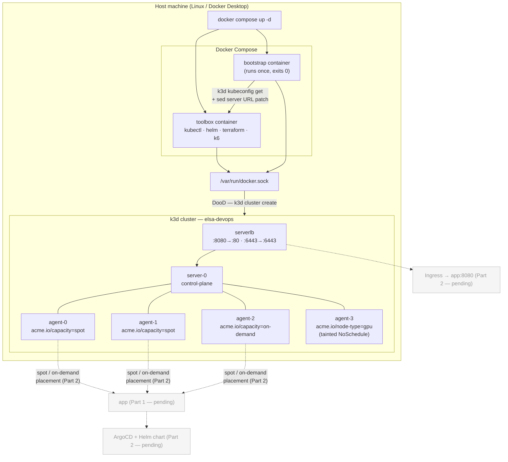

# DevOps Take-Home — Quote API Platform

## Quick Start

```bash
git clone <your-repo> && cd <your-repo>
docker compose up -d
./scripts/run-all.sh
```

`docker compose up -d` builds the toolbox image and immediately runs the cluster bootstrap in one step — no manual commands needed. When the bootstrap container exits you have a 5-node k3d cluster ready for the subsequent scripts.

---

## Architecture Diagram



> **Node labels** (applied by `troubleshoot/prepare.sh` during bootstrap):  
> `agent-0`, `agent-1` → `acme.io/capacity=spot`  
> `agent-2` → `acme.io/capacity=on-demand`  
> `agent-3` → `acme.io/node-type=gpu` + taint `nvidia.com/gpu=true:NoSchedule`

---

## Script Reference

| Script | What it does | When to run |
|---|---|---|
| `scripts/00-bootstrap-cluster.sh` | Creates a 5-node k3d cluster (`--api-port 6443`, `--tls-san`), writes kubeconfig, waits for all nodes Ready, runs `troubleshoot/prepare.sh` if present. Idempotent — safe to re-run. | Run automatically by `docker compose up -d` via the bootstrap service. Can also be called directly inside the toolbox container. |
| `scripts/run-all.sh` | Runs all numbered scripts in order. | `./scripts/run-all.sh` from the host after `docker compose up -d`. |

---

## Design Decisions & Trade-offs

**Docker-out-of-Docker (DooD), not DinD**  
The toolbox and bootstrap containers bind-mount `/var/run/docker.sock` and talk to the host's Docker daemon directly. This avoids the complexity and security surface of running a nested Docker daemon, and means k3d cluster containers are siblings of the toolbox on the host — they survive compose restarts.

**`extra_hosts: host.docker.internal: host-gateway` instead of `network_mode: host`**  
The k3s API server publishes port 6443 on `0.0.0.0` of the host (via `--api-port 6443`). From inside a container we need to reach that host port. `network_mode: host` would work on Linux only and silently breaks on Docker Desktop (Mac/Windows). `extra_hosts` with the `host-gateway` special value resolves `host.docker.internal` to the Docker bridge gateway — works on Linux, and Docker Desktop provides `host.docker.internal` natively on Mac/Windows. Requires Docker Engine ≥ 20.10.

**`--tls-san=host.docker.internal` on the k3s server**  
k3s generates a self-signed cert at cluster creation time. Changing the kubeconfig server URL to `host.docker.internal:6443` (via `sed`) would cause TLS verification to fail unless `host.docker.internal` is in the cert's Subject Alternative Names. The `--k3s-arg '--tls-san=host.docker.internal@server:*'` flag adds it at creation time — no insecure-skip-tls-verify needed.

**Pinned tool versions in the Dockerfile, not `latest`**  
k3d v5.9.0, kubectl v1.36.2, helm v4.2.2, terraform v1.15.6, k6 v1.8.0. Pinning avoids "works on my machine" breakage if an upstream release changes behaviour mid-review.

**k6 v1.8.0 over v2.0.0**  
v2.0.0 is the newest release but v1.8.0 is a more established release from the stable 1.x line. Lower risk for the load-test script in Part 6. (v2.0.0 was also the version that exposed the double-v URL bug in the original generated Dockerfile — see AI-USAGE.md.)

**What was cut (so far)**  
Parts 1–7 are not yet implemented. The repository currently delivers only the cluster harness — the assignment allows partial submissions with notes, and a solid foundation beats a rushed full attempt.

---

## Troubleshooting Notes

**Port 6443 already in use**  
If you have another local Kubernetes cluster (minikube, kind, Docker Desktop Kubernetes) the k3s API server port will conflict. Either stop the other cluster first, or change `--api-port 6443` in `scripts/00-bootstrap-cluster.sh` and update the `sed` pattern on the next line to match.

**Port 8080 already in use**  
The k3d load balancer maps `host:8080 → cluster:80`. If something else owns 8080, change `--port '8080:80@loadbalancer'` in the same script. Note the assignment's `curl http://localhost:<port>/api/quote` step will need the same updated port.

**`host-gateway` not resolved — Docker Engine < 20.10**  
The `extra_hosts: host.docker.internal: host-gateway` entry in `docker-compose.yml` requires Docker Engine 20.10 or later. On older engines the bootstrap container will start but `kubectl get nodes` will fail with a connection refused or TLS error. Upgrade Docker, or as a workaround replace `host-gateway` with your Docker bridge gateway IP (typically `172.17.0.1`, confirm with `ip route | grep docker0`).
