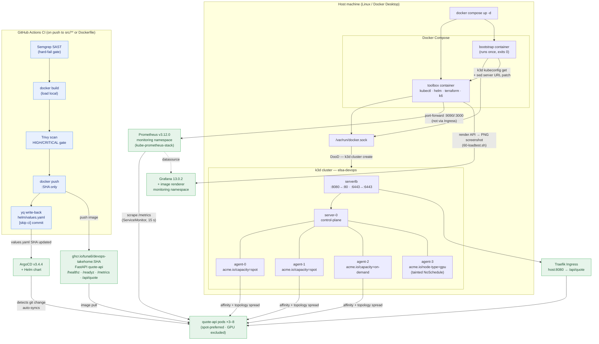

# DevOps Take-Home — Quote API Platform

## Quick Start

```bash
git clone <your-repo> && cd <your-repo>
docker compose up -d
./scripts/run-all.sh
```

`docker compose up -d` builds the toolbox image and immediately runs the cluster bootstrap in one step — no manual commands needed. When the bootstrap container exits you have a 5-node k3d cluster ready for the subsequent scripts.

---

## Architecture Diagram



> **Node labels** (applied by `troubleshoot/prepare.sh` during bootstrap):  
> `agent-0`, `agent-1` → `acme.io/capacity=spot`  
> `agent-2` → `acme.io/capacity=on-demand`  
> `agent-3` → `acme.io/node-type=gpu` + taint `nvidia.com/gpu=true:NoSchedule`

---

## Script Reference

| Script | What it does | When to run |
|---|---|---|
| `scripts/00-bootstrap-cluster.sh` | Creates a 5-node k3d cluster (`--api-port 6443`, `--tls-san`), writes kubeconfig, waits for all nodes Ready, runs `troubleshoot/prepare.sh` if present. Idempotent — safe to re-run. | Run automatically by `docker compose up -d` via the bootstrap service. Can also be called directly inside the toolbox container. |
| `scripts/10-build-push.sh` | Builds the `quote-api` Docker image, tags it with the current git SHA (`ghcr.io/tuna6/devops-takehome:<sha>`), and pushes to GHCR. Idempotent — re-running with the same SHA rebuilds and re-pushes safely. Reads `GITHUB_TOKEN` env var for login if provided; otherwise assumes `docker login ghcr.io` has already been run. | Run once after cloning (image is pre-built at the SHA in this repo). Re-run after any code change in `src/`. |
| `scripts/20-deploy.sh` | Installs ArgoCD (v3.4.4, idempotent) and applies the `quote-api` ArgoCD Application pointing at the Helm chart in this repo. Waits for Synced + Healthy. | Run automatically by `run-all.sh`. Re-runnable to check ArgoCD state. |
| `scripts/25-reclaim-drill.sh` | Spot-node reclaim drill: picks a spot node running a quote-api pod, starts a curl loop, cordons + drains the node (respecting PDB), shows pod rescheduling, then uncordons. Exits 0 if the service stayed reachable within the gap tolerance; prints a placement PASS/WARN (not a hard gate). | Run manually inside the toolbox. Not in `run-all.sh` — node drain is disruptive and requires explicit intent. |
| `scripts/60-loadtest.sh` | Part 6 observability and load test: installs kube-prometheus-stack (Prometheus + Grafana + image renderer) via Helm, applies the ServiceMonitor for `/metrics` scraping, waits for Prometheus to confirm `up{job="quote-api"}=1`, then runs the k6 7-minute ramp test against the Ingress. HPA will scale quote-api from 3 to up to 8 replicas during the run. Idempotent — skips the Helm install if the release already exists. | Run automatically by `run-all.sh`. Takes ~10–15 min total (Helm install + k6 run). Requires `scripts/20-deploy.sh` to have completed first. |
| `scripts/99-teardown.sh` | Deletes the k3d cluster and brings down the compose stack. Handles both the case where the toolbox is running (uses `k3d cluster delete` inside it) and the case where it is not (removes cluster containers/network/volumes directly). | Run from the **host** (not inside the toolbox) when you want to fully reset the environment. |
| `scripts/run-all.sh` | Waits for the compose bootstrap container to finish, then runs the numbered scripts in order inside the toolbox (`20-deploy.sh`, `60-loadtest.sh`). | `./scripts/run-all.sh` from the host after `docker compose up -d`. |

---

## Design Decisions & Trade-offs

**Docker-out-of-Docker (DooD), not DinD**  
The toolbox and bootstrap containers bind-mount `/var/run/docker.sock` and talk to the host's Docker daemon directly. This avoids the complexity and security surface of running a nested Docker daemon, and means k3d cluster containers are siblings of the toolbox on the host — they survive compose restarts.

**`extra_hosts: host.docker.internal: host-gateway` instead of `network_mode: host`**  
The k3s API server publishes port 6443 on `0.0.0.0` of the host (via `--api-port 6443`). From inside a container we need to reach that host port. `network_mode: host` would work on Linux only and silently breaks on Docker Desktop (Mac/Windows). `extra_hosts` with the `host-gateway` special value resolves `host.docker.internal` to the Docker bridge gateway — works on Linux, and Docker Desktop provides `host.docker.internal` natively on Mac/Windows. Requires Docker Engine ≥ 20.10.

**`--tls-san=host.docker.internal` on the k3s server**  
k3s generates a self-signed cert at cluster creation time. Changing the kubeconfig server URL to `host.docker.internal:6443` (via `sed`) would cause TLS verification to fail unless `host.docker.internal` is in the cert's Subject Alternative Names. The `--k3s-arg '--tls-san=host.docker.internal@server:*'` flag adds it at creation time — no insecure-skip-tls-verify needed.

**Pinned tool versions in the Dockerfile, not `latest`**  
k3d v5.9.0, kubectl v1.36.2, helm v4.2.2, terraform v1.15.6, k6 v1.8.0. Pinning avoids "works on my machine" breakage if an upstream release changes behaviour mid-review.

**k6 v1.8.0 over v2.0.0**  
v2.0.0 is the newest release but v1.8.0 is a more established release from the stable 1.x line. Lower risk for the load-test script in Part 6. (v2.0.0 was also the version that exposed the double-v URL bug in the original generated Dockerfile — see AI-USAGE.md.)

**FastAPI over Go/Node for the service**  
Python + FastAPI is the fastest path to a correct, readable ~100-line service with Prometheus instrumentation and JSON responses. `prometheus_client` integrates natively. Go would produce a smaller binary but adds no meaningful value at this scale.

**CPU burn: SHA-256 hashing loop, not `time.sleep`**  
`time.sleep` is I/O wait — the process yields to the OS, burns no CPU, and produces misleading results under a load test. A bare `while True: pass` busy-loop does no real work and can be silently no-op'd by the interpreter or CPU. SHA-256 hashing (`hashlib.sha256`) performs real memory reads/writes and ALU computation each iteration. The loop runs until `time.perf_counter()` reaches the 100 ms deadline — consistent regardless of CPU speed.

**Alpine base image (142 MB) over `python:3.12-slim` (249 MB)**  
All compiled extensions pulled in by `uvicorn[standard]` — `httptools`, `uvloop`, `watchfiles` — and `pydantic-core` publish pre-built `musllinux` wheels on PyPI. No gcc or Rust toolchain is needed in the build stage. Alpine gives a 43% smaller final image with the same security posture (musl libc, no shell in runtime path).

**Multi-stage Dockerfile with virtualenv**  
The builder stage creates a venv at `/venv`, installs all deps, and is discarded. The final stage copies only `/venv` and `main.py` — no pip, no build tools, no cache. Running as explicit `USER 1001` (non-root) with no `--create-home`.

**Git SHA tag on GHCR, no floating `latest`**  
`latest` is mutable and breaks reproducibility — the same tag can resolve to a different image on a re-run. Every push is tagged with the short git SHA (`ghcr.io/tuna6/devops-takehome:<sha>`), making deploys traceable to an exact commit.

**All deps pinned including transitive**  
`src/requirements.txt` pins all 17 packages (direct + transitive) at exact versions captured from `pip freeze`. Upgraded in Part 4 to patch three HIGH-severity starlette CVEs (CVE-2025-62727, CVE-2026-48818, CVE-2026-54283): `fastapi` 0.115.5 → 0.138.0, `starlette` 0.41.3 → 1.3.1, `uvicorn` 0.32.1 → 0.49.0. All three CVEs were caught by the Trivy gate in CI — not by pre-flight code review.

**Spot/on-demand placement: soft constraints over hard pins**  
The assignment asks for "at least one replica always on the on-demand node" but also forbids hard-pinning all replicas to on-demand. These pull in opposite directions for a single Deployment. Three approaches were evaluated:

1. **Hard `DoNotSchedule` topology spread** — would guarantee exactly 1 pod in the on-demand topology bucket, but breaks the reclaim drill: with only 2 topology domains (spot, on-demand) and 0 slack, losing one spot domain leaves a pod Pending with no schedulable domain that satisfies the constraint. The assignment's own drill scenario is the exact failure case.
2. **Two-Deployment split** (one Deployment pinned spot, one pinned on-demand) — would guarantee the split, but fights HPA scale-out semantics (Part 6 needs HPA to control a single replica count, not two coordinated counts), doubles chart/ops surface, and makes PDB reasoning more complex.
3. **Soft `ScheduleAnyway` topology spread + weighted affinity** *(chosen)* — `preferredDuringScheduling` with weight 100 for spot nodes scores them highest; `ScheduleAnyway` topologySpread across `acme.io/capacity` then pulls toward even distribution across capacity types without hard-blocking rescheduling when a domain disappears. The GPU node is excluded by a `requiredDuringScheduling NotIn ["gpu"]` guard (belt-and-suspenders alongside the existing NoSchedule taint).

**Control-plane exclusion:** k3s does NOT apply a `NoSchedule` taint to the server node by default (unlike kubeadm). Without an explicit exclusion, the scheduler treats server-0 as a valid placement target — a user observed exactly this after a deploy cycle. The fix is a cluster-level taint added in `scripts/00-bootstrap-cluster.sh` (`node-role.kubernetes.io/control-plane:NoSchedule`) rather than a chart-level label guard, which more accurately simulates EKS where the control plane is not visible to user workloads at all.

**Residual risk — real, not theoretical:** the 2-spot / 1-on-demand split is the intended steady state but is not guaranteed. This was confirmed by actual measurement in the same verification session that produced the PASS result: one scheduling round (ArgoCD-managed, fresh cluster sync) produced **2 spot / 1 on-demand**; a different scheduling round (manual local apply, rolling update from existing pods) produced **3 spot / 0 on-demand**:

```
# ArgoCD-managed sync (fresh):
NAME                         NODE                      CAPACITY
quote-api-64cbcfdf46-qtjkv   k3d-elsa-devops-agent-0   spot
quote-api-64cbcfdf46-7xgkd   k3d-elsa-devops-agent-1   spot
quote-api-64cbcfdf46-6wvts   k3d-elsa-devops-agent-2   on-demand

# Manual local apply (rolling update):
NAME                       NODE                      CAPACITY
quote-api-9d75bc45-g44j5   k3d-elsa-devops-agent-0   spot  ← 2 pods on same node
quote-api-9d75bc45-ns9fp   k3d-elsa-devops-agent-1   spot
quote-api-9d75bc45-sc9mw   k3d-elsa-devops-agent-0   spot
```

Both runs used the same chart config (weight:100 spot preference, `ScheduleAnyway` topology spread). The variability is the soft constraint working as specified — it scores spot nodes higher and does not block putting all replicas there. Lowering the weight to chase a 2/1 outcome was evaluated and deliberately rejected: a lower weight shifts the probability but still produces no guarantee, and we prefer to document the honest observed range rather than dial in a specific demo result.

The `scripts/25-reclaim-drill.sh` placement check surfaces this at drill time — it will print **WARN** when all-spot placement is observed (not an exit-1 failure) so the outcome is always recorded explicitly. The drill's PASS/FAIL gate is service survivability (curl loop gap ≤ 30 s), not placement split.

**Part 4 CI/CD design decisions**

- **Semgrep over SonarQube** — no external server or account required for public repos with `--config auto`; scan runs in-process and blocks the build before Docker even starts.
- **`push: false, load: true` then explicit push** — builds the image into the local Docker daemon first so Trivy can scan it before it is published. The image only reaches GHCR after both gates (Semgrep + Trivy) pass.
- **`deploy_prod` not migrated** — imperative `kubectl set image` is replaced by the yq write-back + ArgoCD GitOps loop. CI's responsibility ends at publishing a scanned, tagged image and committing the new tag to `helm/quote-api/values.yaml`. ArgoCD detects the commit and reconciles the cluster automatically.
- **Loop prevention: two layers** — `paths: [src/**, Dockerfile]` ensures the write-back commit (which only touches `helm/quote-api/values.yaml`) does not re-trigger CI. `[skip ci]` in the commit message is belt-and-suspenders. A third implicit layer: GitHub does not re-trigger workflows for pushes made by `GITHUB_TOKEN`.
- **Full SHA tag, not short SHA** — CI uses `${{ github.sha }}` (40 chars) for the image tag and values.yaml write-back. `scripts/10-build-push.sh` (the manual dev-path) uses `git rev-parse --short HEAD` (7 chars). These are intentionally different: CI tags are immutable and unambiguous; the manual script is a convenience tool, not a production path.

**Part 6 observability design decisions**

- **kube-prometheus-stack installed via plain Helm, not an ArgoCD Application** — it is third-party observability infrastructure, not "our app's chart." Putting it in ArgoCD would make the ArgoCD Application depend on itself (the CRDs it installs are required for the Application to be applied), creating a chicken-and-egg bootstrap problem. Helm with `--wait` is the correct tool for infra that must be ready before the next step runs.

- **ServiceMonitor as a standalone manifest (`monitoring/servicemonitor.yaml`), not inside `helm/quote-api/templates/`** — if it lived in the app chart, `scripts/20-deploy.sh` would fail on a fresh cluster: ArgoCD applies the Helm chart immediately after install, but kube-prometheus-stack (which provides the `ServiceMonitor` CRD) isn't installed until `scripts/60-loadtest.sh` runs later. The standalone apply in `60-loadtest.sh` step 2 runs after step 1 guarantees the CRD exists.

- **Grafana "latency" panel uses CPU throttle ratio as a proxy, not a true p95 histogram** — `src/main.py`'s `/metrics` endpoint exposes only a request counter (`quote_requests_total`); no histogram or summary was added, so there is no server-side data to compute Prometheus-native latency percentiles from. The CPU CFS throttle ratio (`cfs_throttled_periods / cfs_periods`) is used instead because throttling is the direct mechanism that extends per-request wall time in this app. This is a known limitation and is stated explicitly rather than hidden. Real p95 latency numbers do exist — from k6's client-side measurements (172ms at peak, used for the k6 threshold and reported in `LOADTEST.md`) — they just cannot be served from a Prometheus panel without adding a histogram to the app.

- **k6 thresholds and the PrometheusRule alert threshold were both derived from real measured run data, not generic numbers** — the initial k6 threshold (`p(95)<2000ms`) was derived from a queuing model and passed at 178ms (over 10× margin — effectively a no-op gate). It was caught, the model was corrected (FastAPI anyio thread pool, not serial), and the threshold tightened to `p(95)<400ms` (2.2× the observed 172–179ms), then re-verified. The PrometheusRule alert threshold (≥30% CPU throttle ratio) was set at 2.1× the 14% peak observed during the load test. Full story in `ai-usage/AI-USAGE-2026-06-21_174703-part6.md`.

**What was cut**  
Parts 5 and 7 are not implemented. Parts 1–4 and 6 are complete.

---

## Troubleshooting Notes

**Port 6443 already in use**  
If you have another local Kubernetes cluster (minikube, kind, Docker Desktop Kubernetes) the k3s API server port will conflict. Either stop the other cluster first, or change `--api-port 6443` in `scripts/00-bootstrap-cluster.sh` and update the `sed` pattern on the next line to match.

**Port 8080 already in use**  
The k3d load balancer maps `host:8080 → cluster:80`. If something else owns 8080, change `--port '8080:80@loadbalancer'` in the same script. Note the assignment's `curl http://localhost:<port>/api/quote` step will need the same updated port.

**`host-gateway` not resolved — Docker Engine < 20.10**  
The `extra_hosts: host.docker.internal: host-gateway` entry in `docker-compose.yml` requires Docker Engine 20.10 or later. On older engines the bootstrap container will start but `kubectl get nodes` will fail with a connection refused or TLS error. Upgrade Docker, or as a workaround replace `host-gateway` with your Docker bridge gateway IP (typically `172.17.0.1`, confirm with `ip route | grep docker0`).
